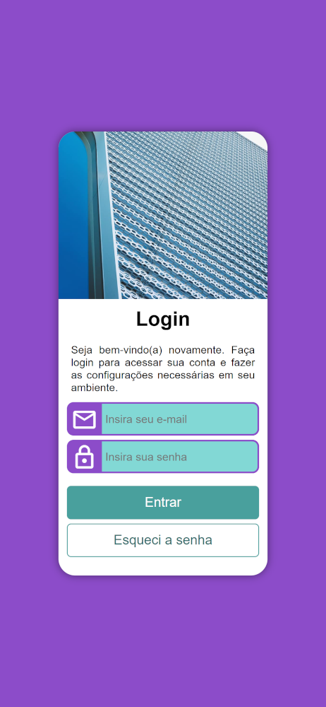
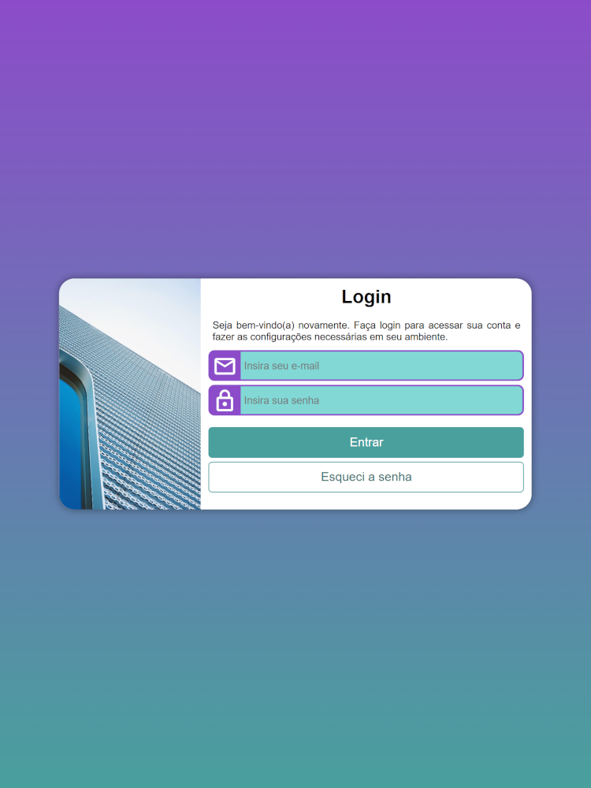
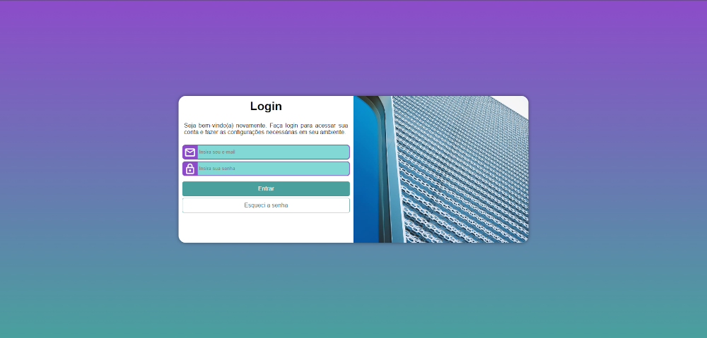

# Projeto Formulário de Login
O projeto consiste em um formulário responsivo de Login, com campos para inserção de e-mail, senha e botão para redefinição de senha. Projeto desenvolvido no curso de HTML5 e CSS3 do [Curso em Vídeo](https://www.cursoemvideo.com), aplicando os conhecimentos estudados e praticados ao longo do curso.     

## Funcionalidades

* Uso de media queries
* Responsividade do conteúdo
* Uso de flutuação de elementos
* Aplicação de posicionamento de elementos
* Aplicação e manipulação de imagens de fundo

## Tecnologias utilizadas

* HTML5
* CSS3

## Acesso ao Projeto

[Acesse o site](https://allan-alves.github.io/Formulario-de-Login/)

## Demonstração em diferentes tamanhos de tela

__Mobile - iPhone 12 Pro - 390 x 844__

__Tablet - iPad Mini - 768 x 1024__

__Desktop - 1920 x 1080__

